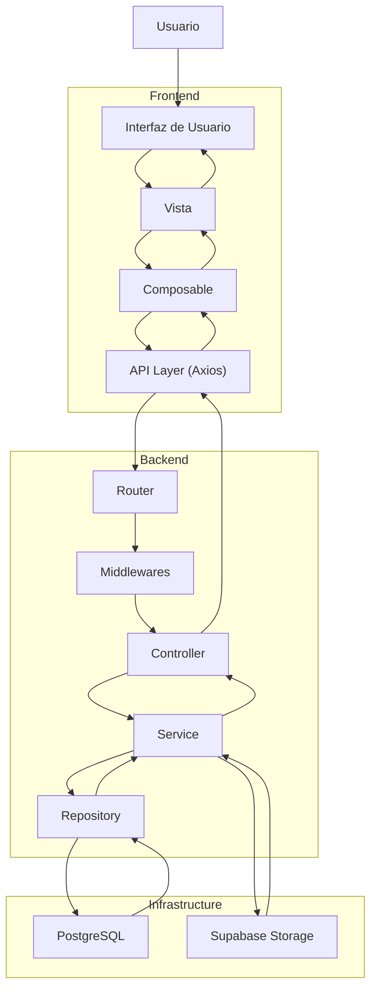

# Application Flow Diagram

## Introducción

Este documento describe el flujo general que sigue una operación dentro de Nexora, desde la interacción inicial del usuario hasta la respuesta final generada por el sistema.

El objetivo es representar cómo colaboran el frontend, el backend y la infraestructura durante la ejecución de un caso de uso, manteniendo una clara separación de responsabilidades entre las distintas capas de la aplicación.

Este flujo aplica a la mayoría de las operaciones del sistema, independientemente del módulo de negocio involucrado (Facturación, Inventario, Clientes, Productos, Dashboard, Store o Marketplace).

---

# Flujo General de una Operación



---

# Secuencia de Ejecución

El flujo de una operación puede resumirse de la siguiente manera:

```text
Usuario

↓

Interfaz

↓

Vista

↓

Composable

↓

API Layer

↓

Backend

↓

Middlewares

↓

Controller

↓

Service

↓

Repository

↓

Base de Datos

↓

Respuesta

↓

Frontend

↓

Actualización de la interfaz
```

---

# Responsabilidad de Cada Etapa

## Usuario

Toda operación comienza mediante una interacción del usuario con la interfaz del sistema.

Por ejemplo:

- iniciar sesión;
- crear una factura;
- consultar productos;
- registrar un pago;
- actualizar información.

---

## Frontend

El frontend transforma la interacción del usuario en una solicitud HTTP.

Durante este proceso:

- recopila los datos del formulario;
- ejecuta validaciones visuales;
- invoca el composable correspondiente;
- utiliza la API Layer para comunicarse con el backend.

No ejecuta reglas de negocio críticas.

---

## API Layer

La capa de API centraliza toda la comunicación HTTP.

Sus responsabilidades incluyen:

- construcción de requests;
- configuración de headers;
- envío del JWT;
- manejo uniforme de errores;
- serialización de datos.

---

## Backend

El backend recibe la solicitud y ejecuta el caso de uso correspondiente.

Durante este proceso intervienen sucesivamente:

- Router;
- Middlewares;
- Controllers;
- Services;
- Repositories.

Cada capa posee una responsabilidad claramente definida.

---

## Base de Datos

Los repositorios interactúan con PostgreSQL para consultar o persistir información.

Toda operación de acceso a datos se encuentra encapsulada dentro de esta capa.

---

## Storage

Cuando una operación requiere recursos binarios (por ejemplo imágenes), el Service interactúa con el proveedor de almacenamiento configurado.

Actualmente el sistema soporta almacenamiento local y Supabase Storage mediante una abstracción común.

---

# Flujo Bidireccional

Una vez finalizada la lógica de negocio, la respuesta recorre el camino inverso.

```text
Repository

↓

Service

↓

Controller

↓

Response HTTP

↓

Frontend

↓

Composable

↓

Vista

↓

Usuario
```

El frontend interpreta la respuesta y actualiza el estado de la interfaz.

---

# Separación de Responsabilidades

Este flujo refleja uno de los principios arquitectónicos más importantes de Nexora:

- el frontend administra únicamente la experiencia de usuario;
- el backend concentra toda la lógica de negocio;
- los repositorios encapsulan el acceso a datos;
- la infraestructura permanece desacoplada del dominio.

Cada componente conoce únicamente la capa inmediatamente inferior, reduciendo el acoplamiento entre módulos y facilitando la evolución del sistema.

---

# Beneficios del Diseño

La organización del flujo aporta múltiples ventajas:

- alta mantenibilidad;
- bajo acoplamiento entre capas;
- reutilización de componentes;
- facilidad para incorporar nuevos módulos;
- pruebas unitarias más sencillas;
- consistencia entre frontend y backend;
- evolución independiente de la infraestructura.

---

# Relación con Otros Diagramas

Este documento ofrece una visión general del recorrido de una operación.

Los detalles de cada etapa se desarrollan en los siguientes diagramas:

- **Backend Request Lifecycle**: profundiza el recorrido interno de una request dentro del backend.
- **Authentication Flow**: describe el proceso completo de autenticación y autorización mediante JWT.
- **Multi-Tenancy Flow**: muestra la construcción y utilización del Tenant Context.
- **Frontend Architecture**: detalla la organización interna del cliente Vue.
- **Invoice Workflow**: representa el flujo de negocio asociado al ciclo de vida de una factura.

En conjunto, estos diagramas permiten comprender la arquitectura completa de Nexora desde la interacción del usuario hasta la persistencia de la información.
