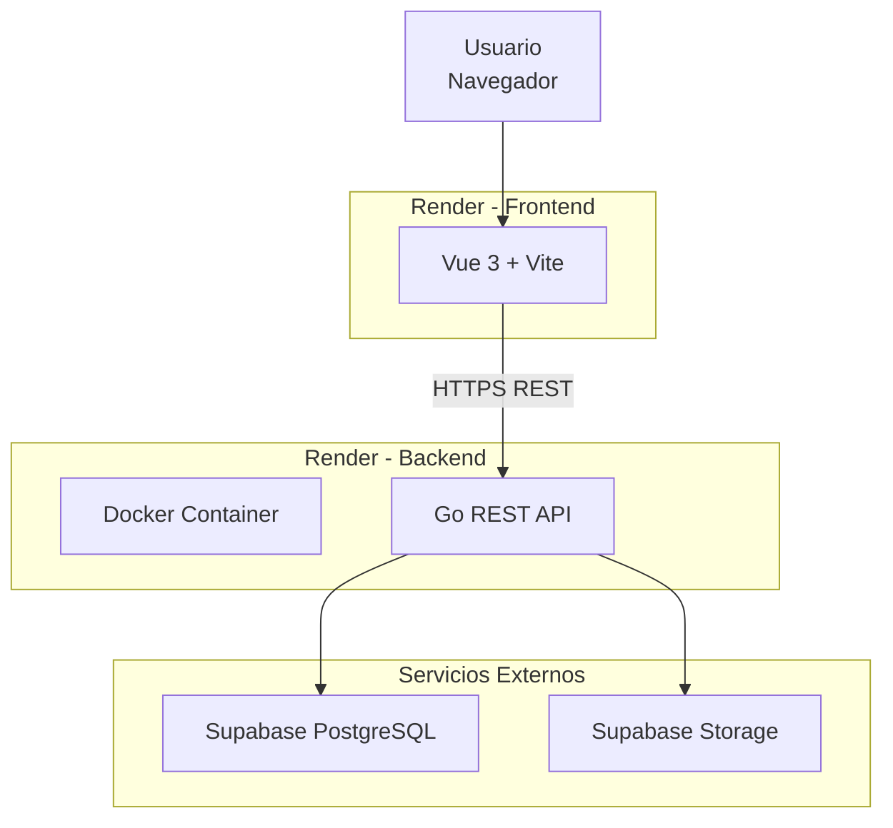

# Deployment Architecture Diagram

## Introducción

Este diagrama representa la arquitectura de despliegue de Nexora y muestra cómo se distribuyen sus distintos componentes en un entorno de ejecución.

Actualmente la plataforma se encuentra dividida en dos aplicaciones completamente independientes:

- Frontend (Vue 3 + Vite)
- Backend (Go)

Ambas aplicaciones se despliegan de forma desacoplada y se comunican exclusivamente mediante una API REST.

Esta separación permite evolucionar, desplegar y escalar cada componente sin afectar al otro.

---

# Arquitectura de Despliegue



---

# Flujo de Comunicación

El flujo completo de una operación puede resumirse de la siguiente forma:

```text
Usuario

↓

Frontend (Render)

↓

REST API

↓

Backend Docker (Render)

↓

Supabase PostgreSQL

↓

Supabase Storage
```

---

# Componentes del Despliegue

## Frontend

El frontend se distribuye como una aplicación construida con Vue 3 y Vite.

Su responsabilidad consiste exclusivamente en:

- renderizar la interfaz;
- gestionar el estado de presentación;
- consumir la API;
- administrar la navegación.

No contiene lógica de negocio crítica.

Toda la información persistente es obtenida desde el backend.

---

## Backend

El backend se ejecuta como una aplicación Go contenida en Docker.

Es responsable de:

- autenticación;
- autorización;
- construcción del Tenant Context;
- ejecución de casos de uso;
- persistencia de datos;
- integración con servicios externos.

Representa la autoridad del dominio de negocio.

---

## PostgreSQL

Supabase PostgreSQL constituye la base de datos principal del sistema.

Almacena toda la información transaccional:

- usuarios;
- empresas;
- clientes;
- productos;
- facturas;
- pagos;
- inventario;
- permisos.

---

## Supabase Storage

Supabase Storage almacena recursos binarios utilizados por la aplicación.

Por ejemplo:

- imágenes de productos;
- imágenes de empresas;
- recursos gráficos.

La API administra el acceso a dichos archivos, evitando que el frontend interactúe directamente con el almacenamiento.

---

# Configuración

Cada aplicación mantiene su propia configuración mediante variables de entorno.

## Frontend

Ejemplos:

```
VITE_API_URL

VITE_ASSETS_URL
```

---

## Backend

Ejemplos:

```
SERVER_PORT

DB_HOST

DB_USER

DB_PASSWORD

SUPABASE_URL

SUPABASE_BUCKET

STORAGE_DRIVER
```

La configuración se encuentra completamente externalizada, permitiendo desplegar el mismo código en distintos entornos sin modificaciones.

---

# Desacoplamiento del Despliegue

Uno de los objetivos arquitectónicos fue mantener independencia entre las aplicaciones.

Esto permite:

- desplegar nuevas versiones del frontend sin modificar el backend;
- actualizar la API sin reconstruir la interfaz;
- escalar ambos componentes de forma independiente;
- facilitar futuras migraciones de infraestructura.

---

# Beneficios de la Arquitectura

La arquitectura de despliegue proporciona múltiples ventajas:

- separación clara entre presentación y negocio;
- despliegues independientes;
- facilidad de mantenimiento;
- escalabilidad horizontal futura;
- integración sencilla con servicios administrados;
- configuración desacoplada mediante variables de entorno.

---

# Evolución Futura

La arquitectura fue diseñada para admitir futuras mejoras sin modificar su estructura principal.

Entre las posibles evoluciones se contemplan:

- incorporación de balanceadores de carga;
- despliegue distribuido de múltiples instancias del backend;
- integración con sistemas de caché;
- incorporación de colas de mensajería;
- adopción de una arquitectura basada en microservicios para determinados dominios.

Estas mejoras pueden incorporarse preservando la organización general del sistema y el bajo acoplamiento entre componentes.
