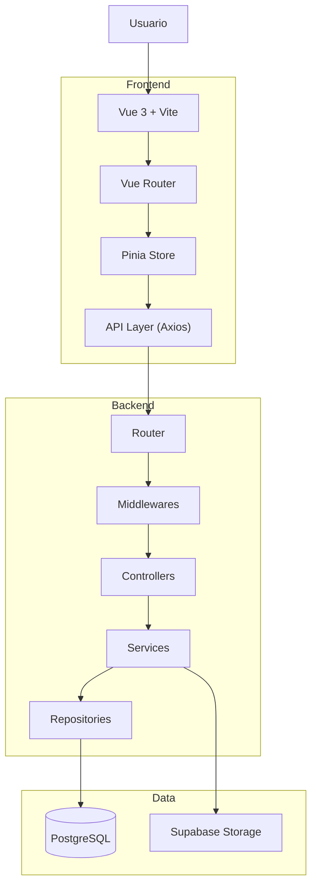

# System Overview Diagram

## Introducción

Este diagrama presenta una visión de alto nivel de la arquitectura completa de Nexora.

Su objetivo es mostrar cómo interactúan los principales componentes del sistema, desde la interfaz de usuario hasta la persistencia de datos y los servicios externos.

La arquitectura fue diseñada siguiendo una clara separación de responsabilidades, donde cada componente cumple un rol específico y se comunica únicamente a través de interfaces bien definidas.

---

# Arquitectura General



---

# Flujo General

El recorrido normal de una operación dentro del sistema puede resumirse de la siguiente forma:

```text
Usuario

↓

Frontend (Vue)

↓

API Layer

↓

Backend (Go)

↓

Middlewares

↓

Controllers

↓

Services

↓

Repositories

↓

PostgreSQL / Supabase Storage
```

---

# Responsabilidades por Capa

## Usuario

Interactúa exclusivamente mediante la interfaz web.

No existe acceso directo a la API ni a la base de datos.

---

## Frontend

Responsable de:

- Renderizar la interfaz.
- Gestionar navegación.
- Administrar estado compartido.
- Consumir la API.
- Mostrar feedback al usuario.

Toda la lógica de negocio permanece en el backend.

---

## Backend

Responsable de:

- Autenticación.
- Autorización.
- Construcción del Tenant Context.
- Validación de reglas de negocio.
- Ejecución de workflows.
- Persistencia de información.

Representa la única fuente de verdad del dominio.

---

## PostgreSQL

Almacena toda la información transaccional del sistema:

- usuarios.
- empresas.
- clientes.
- productos.
- facturas.
- pagos.
- inventario.

---

## Supabase Storage

Responsable del almacenamiento de archivos estáticos, como imágenes y recursos asociados a las entidades del sistema.

---

# Principios Arquitectónicos Representados

El diagrama refleja las principales decisiones arquitectónicas adoptadas durante el desarrollo de Nexora:

- Separación estricta entre frontend y backend.
- Arquitectura multicapa (Layered Architecture).
- Organización por dominios funcionales.
- Backend como única autoridad del negocio.
- Comunicación mediante API REST.
- Persistencia desacoplada mediante repositorios.
- Almacenamiento independiente para recursos binarios.

---

# Objetivo del Diseño

La arquitectura busca garantizar que cada componente evolucione de forma independiente, manteniendo un bajo acoplamiento entre capas y facilitando la incorporación de nuevos módulos, funcionalidades o integraciones sin afectar significativamente al resto del sistema.

Este enfoque permite que Nexora pueda evolucionar de manera progresiva hacia escenarios de mayor complejidad, preservando la mantenibilidad y escalabilidad de la plataforma.
