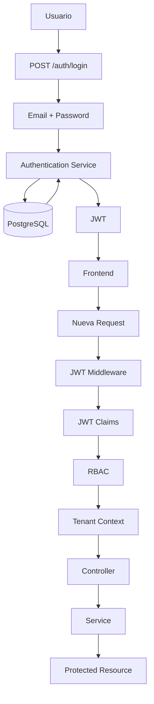

# Authentication Flow Diagram

## Introducción

Este documento describe el flujo completo de autenticación y autorización implementado en Nexora.

El objetivo es mostrar cómo el sistema valida la identidad del usuario, construye el contexto de seguridad y controla el acceso a los distintos recursos de la aplicación.

La autenticación fue diseñada para minimizar consultas repetitivas a la base de datos, manteniendo al mismo tiempo un modelo seguro, escalable y coherente con la arquitectura multicapa del backend.

---

# Flujo General de Autenticación



---

# Flujo Resumido

```text
Login

↓

Validación de credenciales

↓

Generación del JWT

↓

Cliente almacena el token

↓

Nueva petición

↓

Validación del JWT

↓

Construcción del Tenant Context

↓

Validación RBAC

↓

Acceso al dominio
```

---

# Etapas del Proceso

## 1. Inicio de Sesión

El usuario envía sus credenciales mediante el endpoint de autenticación.

```text
POST /auth/login
```

Las credenciales son verificadas contra la información persistida en PostgreSQL.

---

## 2. Validación de Credenciales

El servicio de autenticación verifica:

- existencia del usuario;
- contraseña mediante hash BCrypt;
- estado de la cuenta;
- información necesaria para construir la sesión.

Si las credenciales son válidas, el proceso continúa con la generación del token.

---

## 3. Generación del JWT

Una vez autenticado el usuario, el backend genera un JWT firmado.

El token contiene únicamente la información necesaria para identificar al usuario durante las siguientes peticiones.

Entre los principales datos incluidos se encuentran:

- User ID;
- Email;
- Company ID (cuando corresponde);
- Roles;
- Permisos;
- Fecha de expiración.

Esta información evita consultas repetitivas a la base de datos en cada request.

---

# ¿Por qué los permisos viajan dentro del JWT?

Una de las decisiones arquitectónicas del proyecto fue incluir los permisos del usuario dentro del token.

Esto permite:

- reducir la cantidad de consultas por request;
- disminuir la latencia;
- simplificar la autorización;
- mantener el backend completamente stateless.

Como contrapartida, el tiempo de vida del JWT es limitado, garantizando que los cambios de permisos se reflejen al renovar la sesión.

---

## 4. Almacenamiento del Token

El frontend almacena el JWT y lo envía automáticamente en todas las peticiones protegidas mediante el encabezado:

```text
Authorization: Bearer <token>
```

El frontend nunca interpreta ni modifica los permisos contenidos en el token.

Toda decisión continúa siendo responsabilidad del backend.

---

## 5. Validación del JWT

Cada petición protegida atraviesa el middleware de autenticación.

Durante esta etapa se verifica:

- firma;
- expiración;
- integridad;
- formato.

Una petición con un token inválido es rechazada inmediatamente.

---

## 6. Construcción del Tenant Context

Una vez validado el token, el backend construye el Tenant Context.

Este objeto reúne toda la información necesaria para la ejecución de la request.

Conceptualmente incluye:

- usuario;
- empresa;
- cliente;
- roles;
- permisos;
- contexto multi-tenant.

El contexto permanece disponible durante toda la vida de la petición.

---

## 7. Autorización mediante RBAC

Antes de ejecutar un caso de uso, el sistema verifica que el usuario posea los permisos necesarios.

El modelo RBAC compara:

```text
Permisos requeridos

↓

Permisos presentes en el Tenant Context
```

Si la validación falla, la petición finaliza con un error de autorización.

---

## 8. Ejecución del Caso de Uso

Superadas todas las validaciones anteriores, el Controller delega la ejecución al Service correspondiente.

A partir de este punto, todos los módulos utilizan el Tenant Context construido previamente, sin necesidad de reconstruir la identidad del usuario.

---

# Principios Arquitectónicos

El flujo de autenticación implementado en Nexora responde a los siguientes principios:

- autenticación centralizada;
- autorización desacoplada mediante RBAC;
- construcción única del contexto de seguridad;
- backend stateless;
- reducción de consultas repetitivas;
- separación entre autenticación y lógica de negocio.

---

# Beneficios del Diseño

Esta arquitectura aporta múltiples ventajas:

- mejor rendimiento al evitar consultas innecesarias;
- menor acoplamiento entre módulos;
- reutilización del Tenant Context;
- autorización uniforme;
- trazabilidad durante toda la request;
- facilidad para incorporar nuevos permisos o roles.

---

# Relación con Otros Diagramas

Este documento describe exclusivamente el proceso de autenticación y autorización.

Se complementa con:

- **Backend Layer Architecture**, que describe la organización de las capas del backend.
- **Request Lifecycle**, que muestra el recorrido completo de una petición.
- **Multi-Tenant Flow**, donde se detalla el funcionamiento interno del Tenant Context y el aislamiento entre empresas.

En conjunto, estos diagramas representan el modelo completo de seguridad implementado en Nexora.
