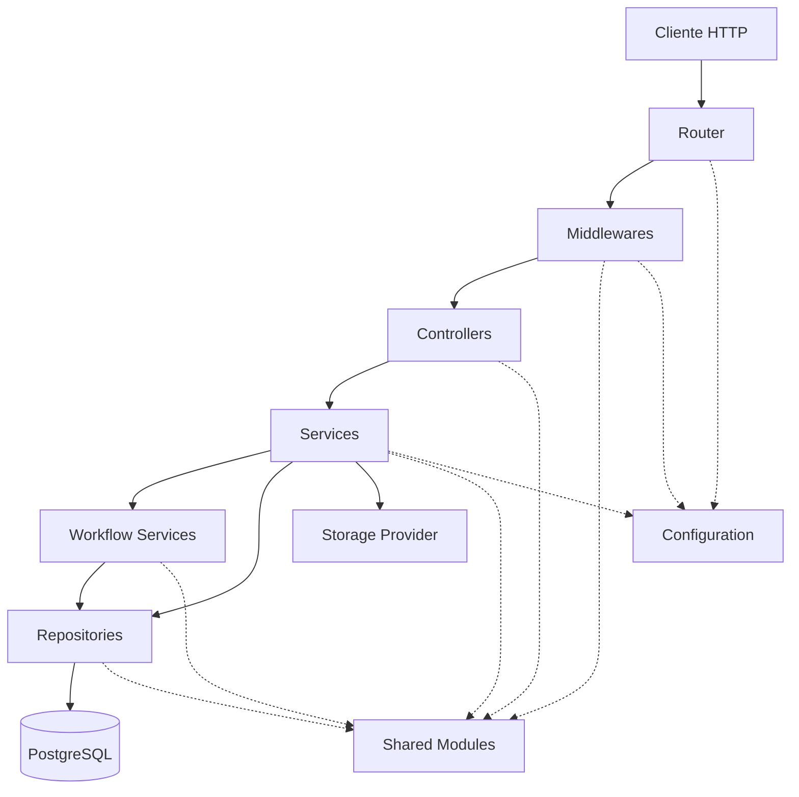

# Backend Layer Architecture

## Introducción

Este documento describe la arquitectura interna del backend de Nexora y la organización de sus principales capas.

El backend fue desarrollado siguiendo una combinación de **Layered Architecture**, **Domain-Oriented Design** y principios de **Clean Architecture**, con el objetivo de mantener una estricta separación de responsabilidades entre los distintos componentes del sistema.

Cada capa posee un rol claramente definido y se comunica únicamente con las capas adyacentes, reduciendo el acoplamiento y facilitando la mantenibilidad, escalabilidad y evolución del proyecto.

---

# Arquitectura General



---

# Organización por Capas

```text
HTTP Request

↓

Router

↓

Middlewares

↓

Controllers

↓

Services

↓

Workflow Services (cuando corresponde)

↓

Repositories

↓

PostgreSQL / Storage
```

Cada capa conoce únicamente la responsabilidad de la siguiente, evitando dependencias innecesarias entre módulos.

---

# Router

El Router constituye el punto de entrada del backend.

Sus responsabilidades son:

- registrar endpoints;
- separar rutas públicas y protegidas;
- asociar middlewares;
- derivar cada request al controlador correspondiente.

No contiene lógica de negocio.

---

# Middlewares

Los middlewares representan la primera etapa del procesamiento de una petición.

Entre sus responsabilidades se encuentran:

- autenticación JWT;
- autorización basada en permisos;
- construcción del Tenant Context;
- observabilidad;
- manejo global de errores;
- validaciones transversales.

Todos los módulos reutilizan esta infraestructura común.

---

# Controllers

Los controladores representan la capa de entrada al dominio.

Su responsabilidad consiste en:

- recibir la request;
- validar parámetros básicos;
- interpretar DTOs;
- invocar el caso de uso correspondiente;
- devolver la respuesta HTTP.

Los controllers no implementan reglas de negocio.

---

# Services

Los Services concentran la lógica de negocio perteneciente a un único dominio.

Por ejemplo:

- Facturación;
- Productos;
- Clientes;
- Empresas;
- Inventario;
- Pagos.

Cada Service coordina la ejecución de repositorios, validaciones y procesos propios de su módulo.

---

# Workflow Services

Cuando una operación involucra múltiples dominios, la lógica se encapsula dentro de un Workflow Service.

Ejemplos:

- Checkout.
- Submit Invoice.
- Pay Invoice.
- Dashboard Overview.

Estos servicios coordinan distintos módulos manteniendo desacopladas las reglas específicas de cada dominio.

---

# Repositories

Los repositorios encapsulan completamente el acceso a PostgreSQL.

Sus responsabilidades incluyen:

- consultas;
- inserciones;
- actualizaciones;
- eliminación lógica;
- mapeo de entidades.

No contienen reglas de negocio.

---

# Shared Modules

Los módulos compartidos contienen infraestructura reutilizable por toda la aplicación.

Entre ellos:

- respuestas HTTP;
- manejo de errores;
- utilidades;
- validaciones;
- RBAC;
- Access Invoice;
- Tenant Context;
- helpers;
- constantes.

Esta capa evita duplicación de código y mantiene la arquitectura consistente.

---

# Configuration

Toda la configuración del sistema se encuentra centralizada.

Incluye:

- variables de entorno;
- conexión a base de datos;
- configuración del servidor;
- almacenamiento;
- JWT;
- observabilidad.

Las capas consumen la configuración sin depender directamente del entorno de ejecución.

---

# Principios Arquitectónicos

La arquitectura del backend fue diseñada respetando los siguientes principios:

- separación estricta de responsabilidades;
- bajo acoplamiento;
- alta cohesión;
- organización por dominios;
- reutilización mediante módulos compartidos;
- infraestructura desacoplada del negocio;
- composición de procesos mediante workflows.

---

# Beneficios del Diseño

La organización por capas aporta numerosas ventajas:

- facilita el mantenimiento;
- reduce el impacto de cambios;
- simplifica las pruebas unitarias;
- favorece la reutilización;
- mejora la legibilidad del código;
- permite incorporar nuevos módulos sin reorganizar la arquitectura existente.

Esta estructura constituye la base sobre la cual se construyen todos los procesos de negocio de Nexora.

---

# Relación con Otros Diagramas

Este documento representa la estructura estática del backend.

Los siguientes diagramas profundizan aspectos particulares de esta arquitectura:

- **Request Lifecycle**: recorrido completo de una petición.
- **Authentication Flow**: autenticación y autorización mediante JWT.
- **Multi-Tenant Flow**: construcción del Tenant Context.
- **Invoice Workflow**: ejecución del principal proceso de negocio.
- **Domain Relationships**: interacción entre los distintos módulos del dominio.

En conjunto, estos documentos ofrecen una visión integral del funcionamiento interno del backend.
