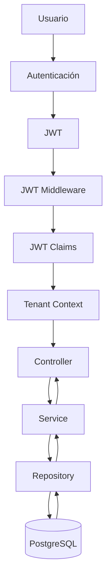

# Multi-Tenant Flow Diagram

## Introducción

Nexora fue concebido desde el inicio como una plataforma **multi-tenant**, donde una única instancia de la aplicación puede atender simultáneamente a múltiples empresas sin comprometer el aislamiento de los datos ni la seguridad.

En lugar de crear una instancia independiente por cliente, el sistema utiliza un **Tenant Context** construido al comienzo de cada petición. Este contexto acompaña toda la ejecución y determina qué información puede consultar o modificar el usuario.

Esta estrategia permite reutilizar la misma infraestructura para múltiples organizaciones, manteniendo un modelo de autorización uniforme y un bajo acoplamiento entre módulos.

---

# Flujo General



---

# Flujo Conceptual

```text
Usuario

↓

Autenticación

↓

JWT

↓

Extracción de Claims

↓

Construcción del Tenant Context

↓

Controller

↓

Service

↓

Repository

↓

Base de Datos
```

---

# ¿Qué es el Tenant Context?

El Tenant Context es un objeto construido una única vez por petición que encapsula toda la información necesaria para identificar el contexto de trabajo del usuario.

Entre los principales datos que contiene se encuentran:

- User ID.
- Company ID.
- Client ID (cuando corresponde).
- Roles.
- Permisos.
- Información básica de autenticación.

Este contexto se almacena en el `context.Context` de Go y queda disponible para todas las capas posteriores.

---

# Construcción del Contexto

Una vez validado el JWT, el middleware extrae los claims y construye el Tenant Context.

Conceptualmente:

```text
JWT

↓

Claims

↓

Tenant Context

↓

context.Context

↓

Request
```

A partir de ese momento, ninguna capa necesita reconstruir la identidad del usuario.

---

# Uso del Tenant Context

Durante la ejecución de la request, cada módulo obtiene el contexto directamente desde el `context.Context`.

Esto permite acceder a información como:

- empresa activa;
- usuario autenticado;
- permisos disponibles;
- roles asociados.

Sin realizar nuevas consultas de autenticación.

---

# Aislamiento entre Empresas

Uno de los objetivos principales del modelo multi-tenant es garantizar que un usuario solo pueda operar sobre la información perteneciente a su organización.

Conceptualmente:

```text
Empresa A

↓

Tenant Context (Company A)

↓

Repositorios

↓

Datos Empresa A


Empresa B

↓

Tenant Context (Company B)

↓

Repositorios

↓

Datos Empresa B
```

Los repositorios utilizan el Company ID disponible en el contexto para limitar automáticamente las consultas sobre la base de datos.

De esta manera, los datos permanecen aislados entre organizaciones sin necesidad de mantener múltiples instancias de la aplicación.

---

# Relación con RBAC

El Tenant Context no solamente identifica la empresa.

También incorpora la información necesaria para aplicar el modelo RBAC.

Durante una operación protegida, el flujo es:

```text
Tenant Context

↓

Permisos

↓

Validación

↓

Acceso al caso de uso
```

Esto permite que autenticación, autorización y aislamiento multi-tenant trabajen de forma integrada.

---

# Beneficios del Modelo

El enfoque adoptado aporta varias ventajas arquitectónicas:

- una única instancia de la aplicación puede atender múltiples empresas;
- se evita duplicar infraestructura;
- el aislamiento lógico permanece centralizado;
- todas las capas consumen el mismo contexto;
- disminuyen las consultas repetitivas de autenticación;
- la incorporación de nuevos módulos mantiene el mismo mecanismo de autorización.

---

# Consideraciones de Seguridad

El Tenant Context es considerado una fuente de confianza únicamente porque es construido a partir de un JWT previamente validado.

Los módulos de negocio nunca aceptan identificadores de empresa enviados por el cliente como mecanismo de autorización.

Toda decisión relacionada con el tenant se obtiene exclusivamente desde el contexto generado por el backend.

Esta estrategia evita que un usuario pueda acceder a información de otra organización manipulando parámetros de entrada.

---

# Escalabilidad

El modelo implementado permite incorporar nuevos dominios funcionales sin modificar la estrategia de aislamiento.

Todo módulo nuevo simplemente consume el Tenant Context ya existente.

Esto mantiene un bajo acoplamiento entre dominios y facilita la evolución de la plataforma hacia nuevos procesos de negocio.

---

# Relación con Otros Diagramas

Este documento explica el funcionamiento interno del modelo multi-tenant implementado en Nexora.

Se complementa con:

- **Authentication Flow**, que describe cómo se autentica al usuario y se construye el contexto.
- **Request Lifecycle**, que muestra el recorrido completo de una petición.
- **Backend Layer Architecture**, que representa la organización estructural del backend.

En conjunto, estos diagramas describen el modelo de seguridad, aislamiento y ejecución utilizado por toda la plataforma.
