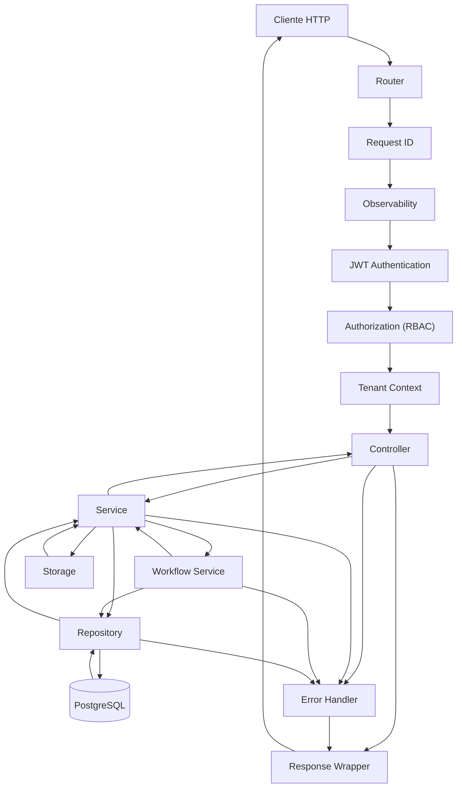

# Request Lifecycle Diagram

## Introducción

Este documento describe el ciclo de vida completo de una petición HTTP dentro del backend de Nexora.

El objetivo es mostrar cómo una solicitud atraviesa las distintas capas del sistema, desde su ingreso al servidor hasta la generación de la respuesta final.

La arquitectura fue diseñada para que cada etapa tenga una responsabilidad claramente definida, manteniendo el desacoplamiento entre módulos y favoreciendo la observabilidad, seguridad y mantenibilidad del sistema.

---

# Ciclo de Vida de una Request



---

# Flujo General

```text
HTTP Request

↓

Router

↓

Request ID

↓

Observabilidad

↓

Autenticación

↓

Autorización

↓

Tenant Context

↓

Controller

↓

Service

↓

Workflow (si aplica)

↓

Repository

↓

PostgreSQL / Storage

↓

Response

↓

Cliente
```

---

# Etapas del Ciclo

## 1. Recepción de la Request

Toda operación comienza cuando el servidor recibe una petición HTTP.

El Router identifica el endpoint solicitado y deriva la ejecución hacia la cadena de middlewares correspondiente.

---

## 2. Generación del Request ID

Al inicio del procesamiento se asigna un identificador único a la petición.

Este identificador permite:

- correlacionar logs;
- reconstruir operaciones;
- facilitar el debugging;
- seguir una misma request durante todo su recorrido.

Cada petición posee un Request ID independiente.

---

## 3. Observabilidad

El middleware de observabilidad registra información relevante durante la ejecución.

Entre otros datos:

- método HTTP;
- endpoint;
- código de respuesta;
- duración;
- errores;
- Request ID.

Estos registros simplifican el análisis operativo del sistema.

---

## 4. Autenticación

Si el endpoint requiere autenticación, el middleware valida el JWT recibido.

Durante este proceso se verifica:

- firma del token;
- expiración;
- integridad de los datos;
- identidad del usuario.

Una request sin autenticación válida finaliza en esta etapa.

---

## 5. Autorización

Una vez autenticado el usuario, el sistema valida los permisos requeridos para acceder al recurso solicitado.

El modelo RBAC determina si la operación está permitida según los permisos incluidos en el contexto del usuario.

---

## 6. Construcción del Tenant Context

Superadas las validaciones anteriores, se construye el Tenant Context.

Este objeto acompaña toda la ejecución de la request y contiene la información necesaria para el aislamiento multi-tenant.

Entre otros datos:

- usuario;
- empresa;
- cliente;
- roles;
- permisos.

Los módulos posteriores consumen esta información sin volver a consultar el contexto de autenticación.

---

## 7. Controller

El Controller interpreta la petición recibida.

Sus responsabilidades incluyen:

- leer parámetros;
- deserializar DTOs;
- realizar validaciones básicas;
- invocar el caso de uso correspondiente.

No implementa reglas de negocio.

---

## 8. Service

El Service ejecuta la lógica correspondiente al dominio involucrado.

Puede:

- aplicar reglas de negocio;
- validar estados;
- coordinar repositorios;
- interactuar con otros servicios.

Cada Service representa un dominio específico del sistema.

---

## 9. Workflow Service

Cuando una operación involucra múltiples dominios, la coordinación se delega a un Workflow Service.

Ejemplos:

- Checkout.
- Submit Invoice.
- Pay Invoice.
- Dashboard Overview.

Esta capa encapsula procesos de negocio transversales sin sobrecargar los Services de dominio.

---

## 10. Repository

Los repositorios representan el único punto de acceso a PostgreSQL.

Toda interacción con la base de datos se encuentra encapsulada dentro de esta capa.

Los Services nunca ejecutan consultas SQL directamente.

---

## 11. Storage

Si la operación requiere trabajar con archivos, el Service interactúa con el proveedor de almacenamiento configurado.

La implementación actual soporta almacenamiento local y Supabase Storage mediante una abstracción común.

---

## 12. Manejo de Errores

Cualquier error producido durante la ejecución es centralizado por el sistema de manejo de errores.

Se distinguen dos grandes categorías:

- errores funcionales;
- errores técnicos.

Cada uno genera una respuesta apropiada tanto para el usuario como para los registros internos del sistema.

---

## 13. Response Wrapper

Antes de responder al cliente, toda salida pasa por un wrapper común.

Esto garantiza consistencia en:

- estructura JSON;
- códigos HTTP;
- mensajes;
- datos devueltos.

El frontend puede interpretar todas las respuestas utilizando un formato uniforme.

---

# Principios Representados

El ciclo de vida de una request refleja varias decisiones arquitectónicas adoptadas durante el desarrollo de Nexora:

- responsabilidades claramente separadas;
- autenticación y autorización centralizadas;
- contexto compartido mediante Tenant Context;
- acceso a datos encapsulado;
- observabilidad integrada;
- manejo uniforme de errores;
- respuestas consistentes.

---

# Beneficios del Diseño

Esta organización proporciona múltiples ventajas:

- facilita el mantenimiento del código;
- simplifica el debugging;
- reduce el acoplamiento entre módulos;
- mejora la trazabilidad de las operaciones;
- favorece la incorporación de nuevos dominios;
- permite mantener un flujo uniforme para todas las peticiones del sistema.

---

# Relación con Otros Diagramas

Este documento representa el recorrido interno de una petición dentro del backend.

Los siguientes diagramas profundizan aspectos específicos del proceso:

- **Backend Layer Architecture**: organización estructural de las capas.
- **Authentication Flow**: detalles del proceso de autenticación y autorización.
- **Multi-Tenant Flow**: construcción y utilización del Tenant Context.
- **Invoice Workflow**: flujo de negocio asociado al agregado Invoice.

En conjunto, estos diagramas describen tanto la estructura como el comportamiento interno del backend de Nexora.
