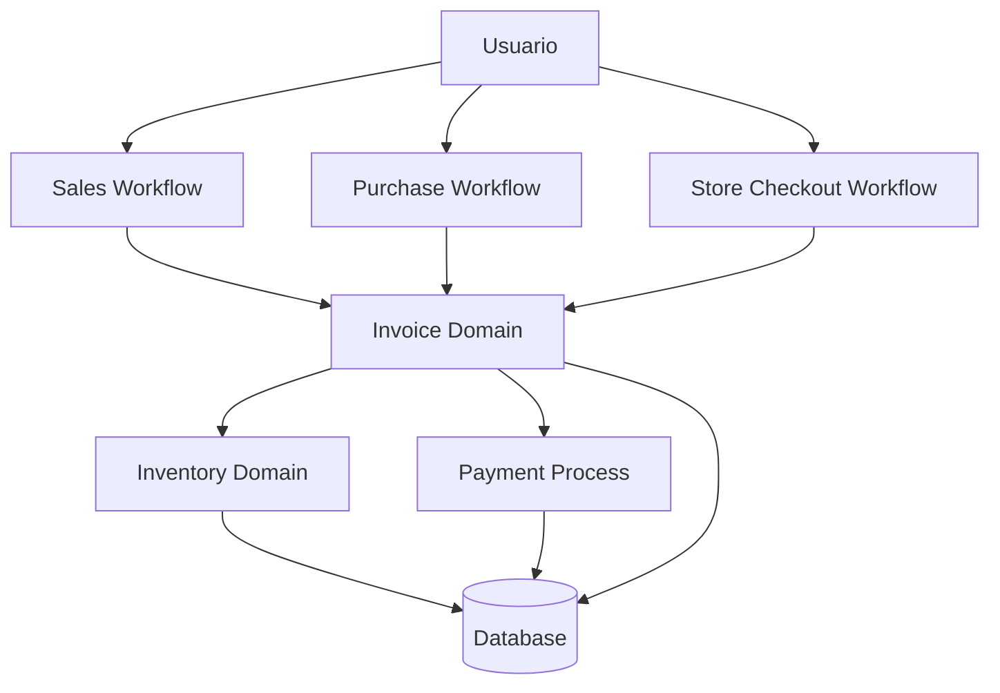

# Business Workflows Diagram

## Introducción

Este documento describe los principales workflows de negocio implementados en Nexora.

A diferencia de una operación CRUD tradicional, cada proceso representa una secuencia de acciones donde participan diferentes dominios del sistema.

Los workflows fueron diseñados para mantener la consistencia del negocio, centralizando validaciones y evitando que cada módulo implemente reglas aisladas.

Los principales procesos documentados son:

- Venta ERP.
- Compra ERP.
- Checkout Store.
- Gestión de inventario.
- Procesamiento de invoice.

---

# Visión General de Workflows



---

# ERP Sales Workflow

## Descripción

Representa una operación de venta realizada dentro del contexto empresarial.

El flujo permite registrar una operación comercial asociada a una empresa y sus clientes.

---

## Flujo

```text
Usuario ERP

↓

Crear Invoice

↓

Agregar Items

↓

Validar Productos

↓

Validar Stock

↓

Confirmar Venta

↓

Actualizar Inventario

↓

Cambiar Estado Invoice

↓

Persistir Operación
```

---

## Participantes

Intervienen:

- Company.
- Customer.
- Product.
- Inventory.
- Invoice.

---

## Reglas principales

Durante el proceso se validan:

- existencia de productos;
- disponibilidad;
- permisos del usuario;
- pertenencia al tenant correcto;
- consistencia de cantidades.

---

# ERP Purchase Workflow

## Descripción

Representa una compra realizada por una organización para abastecimiento interno.

---

## Flujo

```text
Usuario ERP

↓

Crear Purchase Invoice

↓

Agregar Productos

↓

Validar Información

↓

Confirmar Compra

↓

Actualizar Inventario

↓

Completar Operación
```

---

## Características

Una compra ERP afecta principalmente:

- inventario;
- costos;
- registros internos.

No representa una compra personal de Store.

---

# Store Checkout Workflow

## Descripción

Representa una compra realizada desde el flujo comercial de tienda.

Aunque comparte entidades como productos e invoices, mantiene reglas independientes del ERP.

---

## Flujo

```text
Cliente

↓

Seleccionar Productos

↓

Agregar al Carrito

↓

Confirmar Checkout

↓

Crear Invoice

↓

Validar Disponibilidad

↓

Procesar Pago

↓

Actualizar Estado

↓

Confirmar Compra
```

---

# Inventory Workflow

## Descripción

El inventario funciona como un dominio transversal utilizado por diferentes operaciones.

No depende del origen de la operación.

---

## Flujo

```text
Operación Comercial

↓

Solicitud de Stock

↓

Validación Disponibilidad

↓

Reserva / Descuento

↓

Actualización Inventario

↓

Confirmación Workflow
```

---

# Invoice Processing Workflow

## Descripción

La invoice coordina parte importante del flujo comercial.

---

## Flujo

```text
Invoice Created

↓

Draft

↓

Submit

↓

Validation

↓

Approved

↓

Payment

↓

Paid

↓

Complete

↓

Final State
```

---

# Separación ERP vs Store

Una decisión importante del diseño fue separar correctamente los contextos.

```text
ERP

↓

Operaciones organizacionales


Store

↓

Operaciones personales/comerciales
```

Aunque pueden compartir infraestructura:

- productos;
- invoices;
- inventario;

cada flujo mantiene sus propias reglas.

---

# Control de Consistencia

Los workflows garantizan:

- validación antes de persistir;
- estados coherentes;
- actualización ordenada de recursos;
- aislamiento multi-tenant.

---

# Relación con Arquitectura Backend

Los workflows se implementan mediante la separación:

```text
Controller

↓

Service

↓

Business Logic

↓

Repository

↓

Database
```

El controller recibe la intención.

El service ejecuta las reglas.

El repository únicamente persiste información.

---

# Beneficios Arquitectónicos

El modelo basado en workflows permite:

- evitar lógica dispersa;
- representar procesos reales;
- facilitar testing;
- mejorar mantenimiento;
- agregar nuevos procesos comerciales.

---

# Relación con Otros Diagramas

Este documento se complementa con:

- **Domain Overview**, para entender los contextos.
- **Invoice Aggregate**, para conocer la estructura interna.
- **Invoice State Machine**, para entender transiciones.
- **Module Relationships**, para visualizar dependencias.

En conjunto representan el comportamiento completo del dominio Nexora.
