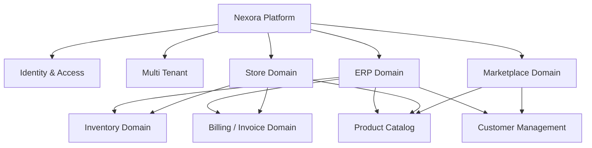

# Domain Overview Diagram

## Introducción

Este documento representa la visión general del dominio de Nexora y la relación entre los principales módulos funcionales del sistema.

Nexora fue diseñado como una plataforma multi-tenant que combina capacidades de ERP empresarial, operaciones comerciales y flujos de tienda.

El modelo de dominio fue organizado separando responsabilidades por contexto funcional, evitando mezclar operaciones organizacionales con operaciones personales.

---

# Visión General del Dominio



---

# Contextos Principales

La plataforma está dividida en diferentes dominios funcionales.

Cada dominio posee responsabilidades específicas y evita depender directamente de detalles internos de otros módulos.

---

# Identity & Access Domain

Este dominio administra la identidad y autorización dentro del sistema.

Responsabilidades:

- autenticación;
- usuarios;
- roles;
- permisos;
- contexto del usuario.

Es la base sobre la cual funcionan todos los demás dominios.

---

# Multi Tenant Domain

El modelo multi-tenant permite que diferentes organizaciones utilicen la plataforma manteniendo aislamiento lógico entre sus datos.

El contexto del tenant determina:

- empresa asociada;
- permisos disponibles;
- recursos accesibles;
- comportamiento de la aplicación.

---

# ERP Domain

Representa las operaciones internas de una organización.

Incluye:

- gestión empresarial;
- clientes;
- productos;
- inventario;
- compras;
- ventas;
- facturación.

Este dominio representa la operación administrativa principal.

---

# Store Domain

Representa los flujos comerciales orientados al usuario final.

Incluye:

- catálogo;
- carrito;
- checkout;
- compras personales;
- pedidos.

Aunque utiliza productos e invoices, posee reglas propias separadas del ERP.

---

# Marketplace Domain

Representa la exposición comercial de productos hacia clientes externos.

Sus responsabilidades incluyen:

- disponibilidad pública;
- catálogo visible;
- condiciones comerciales;
- interacción de compra.

No expone información interna de la organización.

---

# Product Domain

El catálogo de productos funciona como dominio compartido.

Gestiona:

- productos;
- categorías;
- tipos;
- clasificación;
- información comercial.

Otros dominios consumen esta información sin modificar sus reglas internas.

---

# Inventory Domain

El inventario controla la disponibilidad física de productos.

Participa principalmente en:

- reservas;
- descuentos de stock;
- validaciones de disponibilidad.

El inventario es independiente de la interfaz desde donde proviene la operación.

---

# Invoice Domain

La factura representa uno de los agregados centrales del sistema.

Gestiona:

- creación;
- estados;
- validaciones;
- procesos comerciales;
- relación con pagos.

La invoice funciona como representación del ciclo comercial completo.

---

# Customer Domain

Administra las relaciones con clientes.

Puede representar:

- clientes individuales;
- clientes asociados a empresas;
- compradores externos.

Su información es consumida por distintos módulos.

---

# Relaciones Principales

```text
Tenant

↓

Users

↓

Permissions


Company

↓

Products

↓

Inventory

↓

Invoices

↓

Payments
```

---

# Principios del Modelo de Dominio

El diseño del dominio sigue los siguientes principios:

- separación por responsabilidades;
- evitar acoplamiento entre módulos;
- reglas de negocio centralizadas;
- entidades con propósito claro;
- workflows explícitos;
- aislamiento multi-tenant.

---

# Beneficios Arquitectónicos

La separación por dominios permite:

- agregar funcionalidades sin afectar módulos existentes;
- mantener reglas claras;
- facilitar testing;
- evolucionar hacia arquitecturas más avanzadas;
- mejorar la comprensión del sistema.

---

# Relación con Otros Diagramas

Este documento representa la vista general del dominio.

Se complementa con:

- **Invoice Aggregate**, donde se profundiza el modelo de facturación.
- **Invoice State Machine**, donde se documenta el ciclo de vida.
- **Business Workflows**, donde se explican procesos reales.
- **Module Relationships**, donde se muestran dependencias entre módulos.

En conjunto representan el modelo conceptual de Nexora.
