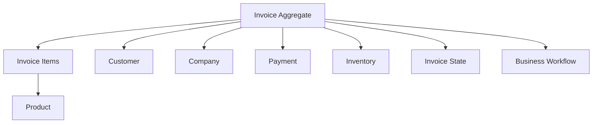

# Invoice Aggregate Diagram

## Introducción

Este documento describe el agregado principal del dominio de facturación de Nexora.

La invoice representa uno de los componentes centrales del sistema, ya que conecta diferentes procesos del negocio como ventas, compras, pagos, inventario y operaciones comerciales.

El diseño fue realizado siguiendo una separación clara entre entidad principal, entidades relacionadas y reglas de negocio asociadas.

Una invoice no representa únicamente un registro almacenado en base de datos, sino un objeto de negocio que atraviesa diferentes estados y controla operaciones críticas del sistema.

---

# Visión General del Agregado



---

# Estructura Conceptual

```text
Invoice

├── Invoice Items
│
├── Customer
│
├── Company
│
├── Payments
│
├── Inventory Impact
│
└── Lifecycle State
```

---

# Invoice Entity

La invoice representa la operación comercial principal.

Sus responsabilidades incluyen:

- identificar una operación;
- mantener su estado actual;
- agrupar productos o servicios;
- controlar transiciones válidas;
- vincular información comercial relacionada.

La invoice funciona como punto central del flujo comercial.

---

# Invoice Items

Los items representan los elementos incluidos dentro de una invoice.

Responsabilidades:

- producto asociado;
- cantidad;
- precio;
- subtotal;
- información necesaria para cálculo.

Los items pertenecen conceptualmente al agregado invoice, ya que no tienen sentido fuera de una operación comercial.

---

# Product Relationship

Los productos son entidades independientes del agregado.

La invoice no administra el ciclo de vida del producto.

Solamente referencia información necesaria para la operación:

- identificación;
- precio aplicado;
- disponibilidad.

Esto evita acoplar el catálogo con la lógica de facturación.

---

# Customer Relationship

La invoice puede estar asociada a un cliente dependiendo del contexto operativo.

Ejemplos:

- venta empresarial;
- compra personal;
- operación comercial externa.

La factura mantiene referencia del participante comercial, pero no administra su ciclo de vida.

---

# Company Relationship

En el modelo multi-tenant, la invoice pertenece al contexto organizacional correspondiente.

La relación con Company permite:

- aislamiento de información;
- operaciones empresariales;
- separación entre tenants.

Toda operación debe respetar el contexto del tenant autenticado.

---

# Payment Relationship

Los pagos representan información relacionada al cumplimiento financiero de la operación.

La invoice utiliza esta relación para validar reglas como:

- saldo pendiente;
- pagos completos;
- confirmación de operaciones.

---

# Inventory Relationship

Las invoices pueden generar impacto sobre inventario.

Ejemplos:

- reserva de productos;
- descuento de stock;
- validación de disponibilidad.

El inventario mantiene sus propias reglas y no depende directamente de la interfaz que origina la operación.

---

# Invoice State

El estado representa la etapa actual del ciclo de vida.

Ejemplo conceptual:

```text
Draft

↓

Submitted

↓

Approved

↓

Paid

↓

Completed
```

Las transiciones son controladas por reglas de negocio.

No cualquier operación puede modificar libremente el estado.

---

# Reglas del Agregado

El agregado protege invariantes del negocio.

Ejemplos:

- una invoice no puede enviarse sin items;
- una invoice completada no puede modificarse;
- una operación debe respetar permisos;
- un pago debe cumplir las condiciones requeridas;
- una transición debe ser válida.

---

# Operaciones del Agregado

Las operaciones importantes no representan simples updates.

Ejemplos:

```text
Create Invoice

Submit Invoice

Approve Invoice

Register Payment

Complete Invoice

Cancel Invoice
```

Cada operación representa una intención de negocio.

---

# Diferencia frente a CRUD

Un enfoque CRUD sería:

```text
PUT /invoice

status = completed
```

El enfoque utilizado es:

```text
POST /invoice/{id}/complete
```

Porque la operación representa una acción del dominio con validaciones propias.

---

# Relación con Arquitectura Backend

El agregado se refleja directamente en la arquitectura:

```text
Controller

↓

Service

↓

Business Workflow

↓

Repository

↓

Database
```

La entidad almacenada es solamente una representación persistente del modelo de negocio.

---

# Beneficios Arquitectónicos

Este diseño permite:

- mantener reglas centralizadas;
- evitar estados inválidos;
- facilitar auditoría;
- simplificar evolución del negocio;
- mantener coherencia entre API y dominio.

---

# Relación con Otros Diagramas

Este documento se complementa con:

- **Domain Overview**, donde se muestra la visión completa.
- **Invoice State Machine**, donde se detallan las transiciones.
- **Business Workflows**, donde se explican procesos reales.
- **Module Relationships**, donde se muestran dependencias entre dominios.

En conjunto representan la arquitectura del dominio comercial de Nexora.
