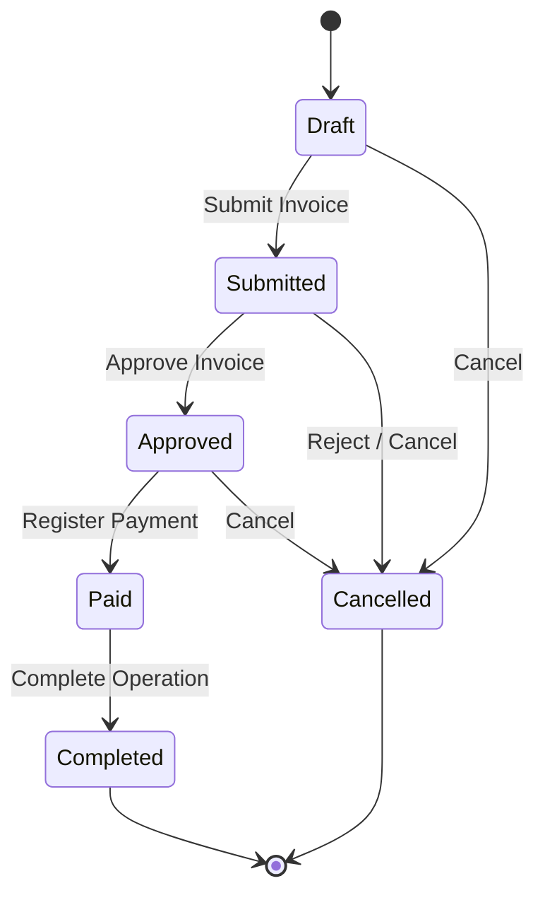

# Invoice State Machine Diagram

## Introducción

Este documento describe el ciclo de vida de una invoice dentro del dominio de Nexora.

La invoice fue diseñada utilizando un modelo basado en estados, donde cada transición representa una acción de negocio válida y no una modificación directa de datos.

El objetivo principal es garantizar que las operaciones comerciales mantengan consistencia durante todo el proceso, evitando estados inválidos y modificaciones arbitrarias.

---

# Máquina de Estados General



---

# Estados Principales

## Draft

Representa una invoice creada pero todavía no confirmada.

Características:

- puede modificarse;
- permite agregar o eliminar items;
- puede validarse antes de avanzar.

Representa una intención comercial todavía no finalizada.

---

## Submitted

Representa una invoice enviada para procesamiento.

En este estado:

- la información principal ya fue cargada;
- comienza el proceso formal;
- determinadas modificaciones pueden quedar restringidas.

---

## Approved

Representa una operación validada.

Implica que:

- las reglas necesarias fueron cumplidas;
- la operación puede continuar;
- los procesos posteriores pueden ejecutarse.

---

## Paid

Representa una invoice cuyo compromiso económico fue cumplido.

Implica:

- pago registrado;
- validaciones financieras realizadas;
- operación lista para finalizar.

---

## Completed

Estado final exitoso.

Representa que:

- la operación terminó correctamente;
- los procesos asociados fueron completados;
- no requiere nuevas acciones.

---

## Cancelled

Estado final alternativo.

Representa una operación que no continuará.

Puede producirse por:

- cancelación manual;
- rechazo;
- imposibilidad de completar el flujo.

---

# Transiciones Permitidas

La transición de estados está controlada por reglas explícitas.

Ejemplo:

```text
Draft

↓

Submit

↓

Submitted
```

No es equivalente a:

```text
Draft

↓

Completed
```

Cada cambio debe pasar por la operación correspondiente.

---

# Reglas de Negocio Asociadas

## Draft → Submitted

Condiciones:

- invoice existente;
- permisos suficientes;
- datos obligatorios completos;
- existencia de items.

---

## Submitted → Approved

Condiciones:

- validaciones comerciales exitosas;
- disponibilidad requerida;
- autorización correspondiente.

---

## Approved → Paid

Condiciones:

- pago válido;
- monto correcto;
- confirmación financiera.

---

## Paid → Completed

Condiciones:

- operaciones finales ejecutadas;
- actualización de recursos necesarios;
- cierre correcto del workflow.

---

# Estados Inmutables

Algunos estados representan puntos donde la modificación debe restringirse.

Ejemplo:

```text
Completed

=

Estado cerrado
```

Una invoice completada no debería modificarse mediante operaciones genéricas.

Cualquier cambio futuro debe representar una nueva operación de negocio.

---

# Relación con API Design

La máquina de estados determina la forma de los endpoints.

No se utiliza:

```http
PUT /invoice/{id}
```

para modificar estados.

En cambio:

```http
POST /invoice/{id}/submit

POST /invoice/{id}/approve

POST /invoice/{id}/complete
```

Cada endpoint representa una intención del dominio.

---

# Relación con Backend

El flujo se implementa mediante:

```text
Controller

↓

Service

↓

Workflow Validation

↓

State Transition

↓

Repository Update
```

La validación ocurre antes de persistir el nuevo estado.

---

# Beneficios del Modelo

La máquina de estados permite:

- evitar operaciones inválidas;
- mantener trazabilidad;
- simplificar debugging;
- representar procesos reales;
- facilitar auditorías;
- evolucionar reglas comerciales.

---

# Ejemplo de Flujo Comercial

```text
Cliente realiza compra

↓

Invoice creada

↓

Draft

↓

Confirmación

↓

Submitted

↓

Validación

↓

Approved

↓

Pago confirmado

↓

Paid

↓

Cierre

↓

Completed
```

---

# Relación con Otros Diagramas

Este documento se complementa con:

- **Invoice Aggregate**, donde se explica la estructura interna.
- **Business Workflows**, donde se describen procesos completos.
- **Module Relationships**, donde se muestran dependencias entre dominios.
- **Domain Overview**, donde se representa la arquitectura general.

En conjunto representan el modelo completo de facturación de Nexora.
