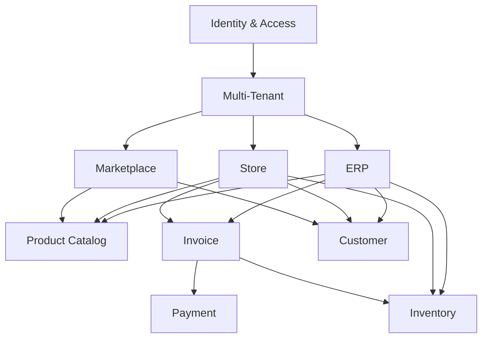

# Module Relationships Diagram

## Introducción

Este documento describe las relaciones entre los principales módulos funcionales de Nexora.

La arquitectura fue organizada mediante dominios separados, donde cada módulo posee responsabilidades específicas y mantiene dependencias controladas con otros contextos.

El objetivo principal es evitar acoplamiento excesivo y permitir que nuevos módulos puedan incorporarse sin modificar completamente la estructura existente.

---

# Vista General de Módulos



---

# Identity & Access

## Responsabilidad

Administra la identidad y autorización dentro de la plataforma.

Incluye:

- usuarios;
- autenticación;
- roles;
- permisos;
- contexto de sesión.

---

## Dependencias

Todos los módulos dependen indirectamente de Identity porque necesitan conocer:

- quién ejecuta una operación;
- qué permisos posee;
- a qué contexto pertenece.

---

# Multi-Tenant Module

## Responsabilidad

Controla el aislamiento lógico entre organizaciones.

Define:

- tenant actual;
- empresa asociada;
- alcance de datos.

---

## Dependencias

Los módulos empresariales utilizan este contexto para garantizar:

- seguridad;
- separación de información;
- operaciones correctas.

---

# ERP Module

## Responsabilidad

Representa la operación interna empresarial.

Incluye:

- ventas;
- compras;
- inventario;
- clientes;
- productos.

---

## Dependencias

ERP utiliza:

```text
Identity

↓

Tenant

↓

Product

↓

Inventory

↓

Invoice
```

---

# Store Module

## Responsabilidad

Gestiona operaciones comerciales orientadas al cliente final.

Incluye:

- catálogo;
- carrito;
- checkout;
- compras personales.

---

## Dependencias

Store utiliza:

```text
Product

↓

Inventory

↓

Invoice

↓

Customer
```

---

# Marketplace Module

## Responsabilidad

Representa la exposición comercial externa.

Permite:

- mostrar productos;
- gestionar disponibilidad;
- interactuar con clientes externos.

---

## Dependencias

Marketplace consume principalmente:

- catálogo;
- clientes;
- disponibilidad.

No accede directamente a lógica interna empresarial.

---

# Product Module

## Responsabilidad

Administra el catálogo base.

Incluye:

- productos;
- categorías;
- tipos;
- clasificación.

---

## Dependencias

Es utilizado por:

- ERP;
- Store;
- Marketplace;
- Inventory.

El catálogo funciona como una capacidad compartida.

---

# Inventory Module

## Responsabilidad

Gestiona la disponibilidad física de productos.

Participa en:

- validación de stock;
- reservas;
- descuentos;
- actualización de cantidades.

---

## Dependencias

Inventory interactúa principalmente con:

- Product;
- Invoice;
- Workflows comerciales.

---

# Invoice Module

## Responsabilidad

Representa operaciones comerciales completas.

Es uno de los módulos centrales del sistema.

Gestiona:

- ciclo de vida;
- estados;
- items;
- validaciones;
- relación financiera.

---

## Dependencias

Invoice interactúa con:

```text
Product

↓

Inventory

↓

Customer

↓

Payment
```

---

# Customer Module

## Responsabilidad

Administra participantes comerciales.

Puede representar:

- clientes individuales;
- clientes empresariales;
- compradores externos.

---

# Payment Module

## Responsabilidad

Gestiona la información relacionada con pagos.

Participa principalmente durante:

- aprobación;
- confirmación;
- finalización de operaciones.

---

# Reglas de Dependencia

El diseño sigue las siguientes reglas:

## Los módulos consumen capacidades

Un módulo no debe modificar directamente información interna de otro dominio.

Ejemplo:

```text
Store

consume

Product
```

pero no modifica las reglas internas del catálogo.

---

## La lógica de negocio permanece en su dominio

Ejemplo:

Inventory decide cómo modificar stock.

Invoice decide cómo cambiar estados.

Payment decide cómo validar pagos.

---

# Separación ERP / Store

Una decisión arquitectónica importante fue mantener separados ambos contextos.

Aunque comparten recursos:

```text
Product

Invoice

Inventory
```

poseen diferentes reglas de negocio.

---

# Evolución Futura

La separación modular permite incorporar nuevos dominios como:

- reporting;
- analytics;
- notificaciones;
- automatizaciones;
- integraciones externas.

Sin necesidad de modificar los módulos principales.

---

# Beneficios Arquitectónicos

Este diseño permite:

- bajo acoplamiento;
- alta cohesión;
- evolución independiente;
- mejor testing;
- mantenimiento simplificado;
- escalabilidad funcional.

---

# Relación con Otros Diagramas

Este documento complementa:

- **Domain Overview**, para la visión conceptual.
- **Invoice Aggregate**, para el núcleo comercial.
- **Invoice State Machine**, para el ciclo de vida.
- **Business Workflows**, para procesos completos.

En conjunto representan la arquitectura completa del dominio Nexora.
