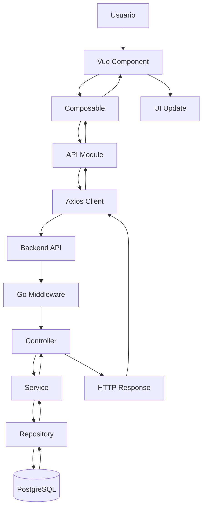

# API Request Flow Diagram

## Introducción

Este documento describe el ciclo completo de una petición realizada desde el frontend de Nexora hasta el backend.

La arquitectura fue diseñada para mantener una separación estricta entre la interfaz de usuario, la lógica de interacción, la comunicación HTTP y los servicios de negocio.

El objetivo principal fue evitar que los componentes visuales conozcan detalles de infraestructura, manteniendo una cadena clara de responsabilidades.

---

# Flujo General



---

# Flujo Conceptual

```text
Usuario

↓

Component

↓

Composable

↓

API Layer

↓

Axios

↓

Backend

↓

Middleware

↓

Controller

↓

Service

↓

Repository

↓

Database

↓

Response

↓

UI Update
```

---

# Capa de Componentes

Los componentes Vue representan la capa visual de la aplicación.

Sus responsabilidades son:

- mostrar información;
- capturar interacción del usuario;
- disparar acciones.

Los componentes no realizan:

- llamadas HTTP;
- validaciones de negocio;
- manejo directo de autenticación.

---

# Capa de Composables

Los composables funcionan como capa intermedia entre la interfaz y la infraestructura.

Sus responsabilidades incluyen:

- coordinar operaciones;
- administrar estados de carga;
- procesar respuestas;
- reutilizar lógica entre componentes.

Ejemplo conceptual:

```text
InvoiceView

↓

useInvoices()

↓

invoiceApi.submit()
```

Esto evita duplicación y mantiene los componentes simples.

---

# API Layer

La capa API encapsula la comunicación con el backend.

Centraliza:

- definición de endpoints;
- parámetros;
- payloads;
- respuestas esperadas.

Ejemplo conceptual:

```text
Composable

↓

Invoice API

↓

POST /api/invoices/{id}/submit
```

Los componentes desconocen completamente la estructura HTTP.

---

# Axios Client

Axios funciona como cliente HTTP centralizado.

Sus responsabilidades incluyen:

- base URL;
- headers;
- JWT;
- configuración común;
- manejo general de peticiones.

Toda la aplicación utiliza la misma instancia.

---

# Comunicación con Backend

Una vez enviada la petición, ingresa al backend.

El flujo continúa siguiendo la arquitectura definida:

```text
Request

↓

Middleware

↓

Controller

↓

Service

↓

Repository

↓

Database
```

Cada capa mantiene su responsabilidad específica.

---

# Integración con Middleware

Antes de llegar al controlador, la petición atraviesa los middlewares.

Entre sus responsabilidades:

- autenticación;
- validación JWT;
- construcción del Tenant Context;
- validación de permisos;
- observabilidad.

Esto garantiza que los servicios reciban únicamente peticiones válidas.

---

# Response Flow

La respuesta realiza el camino inverso:

```text
Database

↓

Repository

↓

Service

↓

Controller

↓

HTTP Response

↓

Axios

↓

API Layer

↓

Composable

↓

Component

↓

UI
```

Cada capa transforma la información según su responsabilidad.

---

# Manejo de Estados

Durante una petición el frontend administra distintos estados:

```text
Idle

↓

Loading

↓

Success

↓

Error
```

Esto permite representar correctamente:

- carga;
- resultados exitosos;
- errores funcionales;
- problemas de conexión.

---

# Manejo de Errores

Los errores mantienen una estrategia consistente.

El backend diferencia:

- errores de negocio;
- errores técnicos.

El frontend interpreta la respuesta y muestra el mensaje adecuado sin exponer detalles internos.

Ejemplo:

```text
Database Error

↓

Backend Log

↓

HTTP 500

↓

Mensaje UX genérico
```

---

# Principios Arquitectónicos

Este flujo respeta los siguientes principios:

- componentes desacoplados de infraestructura;
- API centralizada;
- lógica reutilizable mediante composables;
- backend como fuente de verdad;
- separación de responsabilidades;
- comunicación uniforme.

---

# Beneficios del Diseño

La arquitectura permite:

- cambiar endpoints sin modificar componentes;
- incorporar nuevos módulos fácilmente;
- reutilizar lógica entre pantallas;
- mantener consistencia en errores;
- simplificar debugging;
- evolucionar frontend y backend de forma independiente.

---

# Relación con Otros Diagramas

Este documento completa la visión dinámica del frontend.

Se relaciona directamente con:

- **Frontend Architecture**, que explica la estructura general.
- **Authentication Flow**, que describe la creación de sesión.
- **State Management**, que explica cómo se conserva el estado.
- **Navigation Flow**, que muestra el recorrido del usuario.

En conjunto representan el ciclo completo de ejecución del frontend de Nexora.
