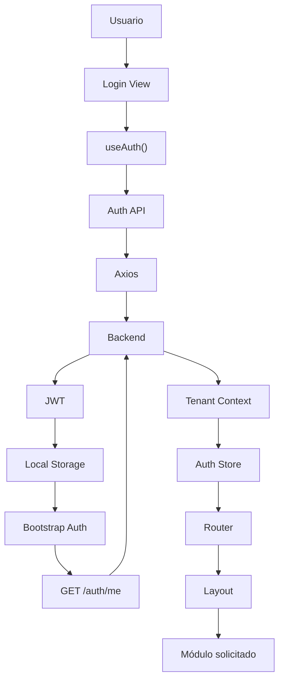

# Authentication Flow Diagram

## Introducción

Este documento describe el flujo completo de autenticación implementado en el frontend de Nexora.

El objetivo principal del diseño fue mantener al frontend completamente desacoplado de la lógica de autenticación, delegando todas las decisiones de seguridad al backend y limitando la responsabilidad del cliente a gestionar el estado de sesión, el contexto del usuario y la navegación.

El proceso fue diseñado para integrarse naturalmente con la arquitectura multi-tenant de la plataforma, donde el comportamiento completo de la interfaz depende del `Tenant Context` recibido desde la API.

---

# Flujo General



---

# Flujo Conceptual

```text
Login

↓

Backend

↓

JWT

↓

Guardar Token

↓

Bootstrap

↓

GET /auth/me

↓

Tenant Context

↓

Pinia

↓

Router

↓

Aplicación
```

---

# Inicio de Sesión

El proceso comienza cuando el usuario envía sus credenciales desde la vista de autenticación.

La vista no realiza llamadas HTTP directamente.

Toda la operación se delega al composable correspondiente.

---

# Composable de Autenticación

La lógica de autenticación se encuentra encapsulada dentro de `useAuth()`.

Sus principales responsabilidades incluyen:

- iniciar sesión;
- almacenar el token;
- obtener el contexto del usuario;
- actualizar el estado global;
- coordinar la navegación.

Esto mantiene la lógica separada de los componentes visuales.

---

# API Layer

El composable utiliza la capa API para comunicarse con el backend.

Esta capa encapsula:

- endpoints;
- serialización;
- manejo de errores;
- configuración HTTP.

Los componentes desconocen completamente cómo se realiza la comunicación.

---

# Recepción del JWT

Una vez autenticado el usuario, el backend devuelve un JWT.

El frontend almacena el token para reutilizarlo en las siguientes peticiones protegidas.

El contenido del JWT nunca es utilizado para tomar decisiones de negocio dentro de la interfaz.

---

# Bootstrap de Autenticación

Cuando la aplicación inicia, se ejecuta un proceso de bootstrap.

Este proceso verifica si existe un token previamente almacenado.

Si el token es válido, el frontend solicita el contexto actualizado del usuario mediante:

```text
GET /auth/me
```

De esta manera, el estado de la aplicación siempre se reconstruye utilizando información proporcionada por el backend.

---

# Obtención del Tenant Context

El endpoint `/auth/me` devuelve el contexto completo del usuario.

Entre otros datos:

- usuario;
- empresa;
- cliente;
- roles;
- permisos;
- información de autenticación.

Este objeto representa la única fuente de verdad utilizada por el frontend.

---

# Estado Global

El Tenant Context se almacena dentro del Auth Store de Pinia.

Este estado queda disponible para:

- Router Guards;
- Layouts;
- Componentes;
- Composables.

No es necesario volver a consultar la información del usuario durante la misma sesión.

---

# Navegación

Una vez cargado el estado global, el Router determina qué módulo debe mostrarse.

La navegación depende del contexto recibido desde el backend.

El frontend nunca intenta deducir permisos mediante reglas propias.

---

# Responsabilidades del Frontend

Durante todo el proceso el frontend únicamente:

- gestiona la sesión;
- almacena el estado compartido;
- coordina la navegación;
- representa la interfaz.

Toda la lógica de autenticación y autorización permanece centralizada en el backend.

---

# Principios Arquitectónicos

El flujo implementado responde a varios principios adoptados durante el desarrollo:

- autenticación delegada al backend;
- frontend sin lógica de negocio;
- estado global centralizado;
- composición mediante composables;
- navegación basada en contexto;
- integración natural con el modelo multi-tenant.

---

# Beneficios del Diseño

La arquitectura implementada aporta múltiples ventajas:

- evita duplicar reglas de negocio;
- mantiene una única fuente de verdad;
- simplifica el mantenimiento;
- facilita la incorporación de nuevos módulos;
- mejora la consistencia entre frontend y backend;
- reduce el acoplamiento entre componentes.

---

# Relación con Otros Diagramas

Este documento describe exclusivamente el proceso de autenticación del frontend.

Se complementa con:

- **Frontend Architecture**, que representa la organización general de la aplicación.
- **Navigation Flow**, donde se documenta el recorrido de la navegación.
- **State Management**, que describe la organización del estado global mediante Pinia.
- **API Request Flow**, que explica el ciclo completo de comunicación con el backend.

En conjunto, estos diagramas describen el funcionamiento interno del frontend de Nexora.
