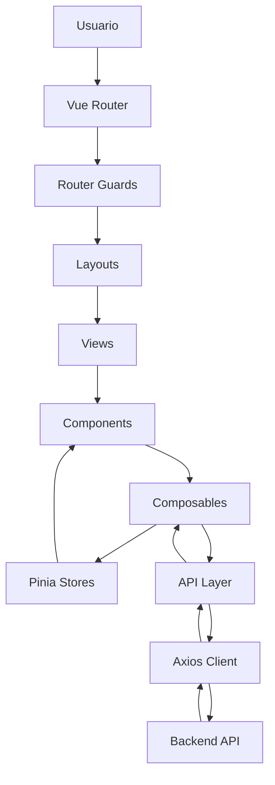

# Frontend Architecture Diagram

## Introducción

Este documento describe la arquitectura interna del frontend de Nexora y la organización de sus principales capas.

El frontend fue desarrollado utilizando **Vue 3**, **Composition API** y **Pinia**, siguiendo una arquitectura modular orientada a dominios funcionales. El objetivo principal fue construir una aplicación escalable, mantenible y consistente con la arquitectura del backend.

La organización prioriza la separación entre presentación, estado, navegación, infraestructura y comunicación con la API, evitando que la lógica de negocio quede distribuida dentro de los componentes visuales.

---

# Arquitectura General



---

# Organización General

```text
Usuario

↓

Router

↓

Guards

↓

Layouts

↓

Views

↓

Components

↓

Composables

↓

Pinia / API Layer

↓

Axios

↓

Backend
```

Cada capa posee una responsabilidad específica y evita asumir tareas correspondientes a otros niveles de la aplicación.

---

# Router

El Router constituye el punto de entrada del frontend.

Sus responsabilidades incluyen:

- registrar rutas;
- diferenciar rutas públicas y protegidas;
- aplicar guards;
- seleccionar el layout adecuado;
- controlar la navegación.

No contiene lógica de negocio.

---

# Router Guards

Los Router Guards verifican las condiciones necesarias antes de permitir la navegación.

Entre ellas:

- existencia del token;
- carga del Tenant Context;
- autenticación;
- autorización visual.

Los Guards controlan el acceso a la interfaz, mientras que el backend continúa siendo la autoridad final sobre los permisos.

---

# Layouts

Los Layouts definen la estructura general de la aplicación.

Ejemplos:

- Public Layout.
- ERP Layout.
- Store Layout.
- Marketplace Layout.

Cada uno encapsula elementos compartidos como:

- navegación;
- sidebar;
- topbar;
- estructura principal.

Las vistas únicamente renderizan el contenido específico de cada módulo.

---

# Views

Las Views representan las páginas principales de la aplicación.

Su responsabilidad consiste en:

- organizar la interfaz;
- consumir composables;
- coordinar componentes.

No contienen lógica de negocio compleja.

---

# Components

Los Components encapsulan elementos reutilizables de la interfaz.

Se diseñaron siguiendo una filosofía de:

- componentes pequeños;
- responsabilidad única;
- alta reutilización.

Esta estrategia facilita el mantenimiento y reduce la duplicación de código.

---

# Composables

La lógica reutilizable se implementa mediante Composition API.

Ejemplos:

- useAuth();
- useProducts();
- useInvoices();
- useCompany();
- useDashboard();

Los composables abstraen el comportamiento compartido y mantienen los componentes visuales libres de lógica compleja.

---

# Pinia Stores

Pinia centraliza únicamente el estado compartido por toda la aplicación.

Entre los principales stores se encuentran:

- autenticación;
- Tenant Context;
- usuario;
- permisos;
- estados globales de carga.

Cada store posee una responsabilidad claramente definida, evitando concentrar información de múltiples dominios en un único lugar.

---

# API Layer

Toda la comunicación con el backend se encuentra encapsulada dentro de una capa específica.

Esta capa centraliza:

- endpoints;
- serialización;
- manejo de errores;
- configuración HTTP.

Los componentes nunca realizan llamadas HTTP directamente.

---

# Axios Client

Toda la aplicación utiliza una única instancia centralizada de Axios.

Su configuración incluye:

- Base URL;
- JWT;
- Credentials;
- Headers comunes;
- Interceptores.

Esto garantiza un comportamiento uniforme para todas las peticiones.

---

# Backend

El frontend consume exclusivamente los casos de uso expuestos por la API.

Toda la lógica de negocio permanece implementada en el backend.

El frontend se limita a:

- gestionar el estado visual;
- coordinar la navegación;
- representar la información recibida.

---

# Principios Arquitectónicos

La arquitectura del frontend fue diseñada respetando los siguientes principios:

- separación entre presentación y lógica;
- organización por dominios;
- reutilización mediante Composition API;
- estado global acotado;
- infraestructura HTTP desacoplada;
- simetría arquitectónica con el backend;
- escalabilidad mediante módulos independientes.

---

# Beneficios del Diseño

La organización adoptada aporta múltiples ventajas:

- facilita la incorporación de nuevos módulos;
- reduce el acoplamiento entre componentes;
- simplifica el mantenimiento;
- mejora la reutilización;
- favorece la consistencia visual;
- mantiene una comunicación uniforme con la API.

La arquitectura permite que el frontend evolucione de forma independiente sin afectar la estructura general de la aplicación.

---

# Relación con Otros Diagramas

Este documento representa la estructura estática del frontend.

Los siguientes diagramas profundizan aspectos específicos de su funcionamiento:

- **Authentication Flow**: proceso de autenticación y carga del Tenant Context.
- **Navigation Flow**: recorrido de una navegación dentro de la SPA.
- **State Management**: organización y utilización de Pinia.
- **API Request Flow**: comunicación entre la interfaz y el backend.
- **Component Organization**: composición y reutilización de componentes.

En conjunto, estos diagramas ofrecen una visión completa de la arquitectura del frontend implementada en Nexora.
