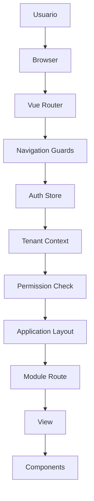

# Navigation Flow Diagram

## Introducción

Este documento describe el flujo de navegación dentro del frontend de Nexora.

La navegación fue diseñada teniendo en cuenta la arquitectura multi-tenant y el modelo de permisos definido por el backend. El objetivo principal fue permitir que diferentes tipos de usuarios puedan acceder a distintos módulos de la aplicación utilizando una única aplicación frontend, manteniendo una estructura clara y escalable.

El Router actúa exclusivamente como controlador de navegación. No contiene reglas de negocio ni reemplaza la autorización del backend.

---

# Flujo General de Navegación



````

---

# Flujo Conceptual

```text
Usuario

↓

Router

↓

Navigation Guard

↓

Auth State

↓

Tenant Context

↓

Permission Validation

↓

Layout

↓

Module

↓

View

↓

Component
```

---

# Entrada a la Aplicación

Cuando un usuario accede a la aplicación, el frontend inicia el proceso de reconstrucción del estado de sesión.

El flujo inicial es:

```text
Aplicación inicia

↓

Bootstrap Auth

↓

Validación de sesión

↓

Carga Tenant Context

↓

Inicialización Router

```

La aplicación no permite navegar hacia módulos protegidos hasta disponer del contexto necesario.

---

# Router

El Router es responsable de:

- registrar rutas;
- resolver navegación;
- aplicar guards;
- cargar layouts;
- seleccionar vistas.

No realiza:

- validaciones de negocio;
- consultas directas a base de datos;
- decisiones de seguridad definitivas.

---

# Navigation Guards

Los guards funcionan como una primera barrera de acceso visual.

Sus responsabilidades principales son:

- verificar autenticación;
- comprobar existencia de contexto;
- validar permisos necesarios para visualizar un módulo.

Ejemplo conceptual:

```text
Usuario intenta acceder a:

/erp/invoices


↓

Existe sesión?

↓

Existe permiso invoices.read?

↓

Permitir navegación

```

---

# Separación entre Navegación y Seguridad

El frontend implementa control de acceso visual, pero no es la autoridad de seguridad.

El flujo correcto es:

```text
Frontend

↓

Oculta módulos no permitidos

↓

Backend

↓

Valida autorización real
```

Esto evita duplicar reglas críticas y mantiene una única fuente de verdad.

---

# Organización por Módulos

Las rutas fueron organizadas siguiendo los dominios funcionales del sistema.

Ejemplo conceptual:

```text
ERP

├── Dashboard
├── Companies
├── Clients
├── Products
├── Inventory
├── Sales
└── Purchases


Store

├── Catalog
├── Cart
└── Orders
```

Cada módulo posee sus propias vistas y componentes relacionados.

---

# Layout Resolution

Una vez aprobada la navegación, el Router determina qué estructura visual utilizar.

Ejemplo:

```text
Usuario autenticado empresa

↓

ERP Layout


Usuario cliente

↓

Store Layout
```

Los layouts contienen la estructura común de navegación, mientras que las vistas contienen el contenido específico.

---

# Navegación Protegida

El acceso a rutas protegidas sigue el siguiente flujo:

```text
Request Navigation

↓

Router Guard

↓

Auth Store

↓

Tenant Context

↓

Permission Validation

↓

Render Module
```

Si alguna condición falla, el usuario es redirigido al flujo correspondiente.

---

# Navegación Multi-Tenant

Debido al modelo multi-tenant, una misma aplicación puede presentar diferentes experiencias según el contexto del usuario.

El comportamiento depende de:

- usuario autenticado;
- empresa asociada;
- permisos;
- módulos disponibles.

No existen aplicaciones separadas para cada tipo de usuario.

---

# Beneficios Arquitectónicos

El diseño de navegación permite:

- agregar nuevos módulos sin reorganizar la aplicación;
- mantener rutas separadas por dominio;
- centralizar reglas de navegación;
- reutilizar layouts;
- mantener consistencia con el backend.

---

# Relación con Otros Diagramas

Este documento se complementa con:

- **Frontend Architecture**, donde se explica la estructura general.
- **Authentication Flow**, donde se describe cómo se obtiene el contexto inicial.
- **State Management**, donde se documenta cómo se mantiene la sesión.
- **API Request Flow**, donde se explica la comunicación con backend.

En conjunto representan el ciclo completo desde que un usuario entra a la aplicación hasta que accede a un módulo funcional.

```

```
````
