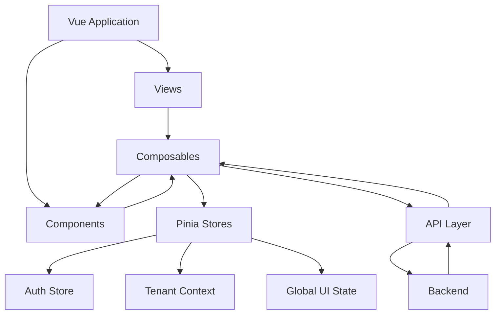

# State Management Diagram

## Introducción

Este documento describe la estrategia de manejo de estado utilizada en el frontend de Nexora.

La arquitectura de estado fue diseñada utilizando **Pinia** como solución centralizada, pero aplicando un criterio restrictivo: únicamente se almacena globalmente información que realmente necesita ser compartida entre múltiples partes de la aplicación.

El objetivo fue evitar un estado global excesivo y mantener cada dominio con una responsabilidad claramente definida.

---

# Arquitectura General del Estado



---

# Flujo del Estado

```text
Backend

↓

API Layer

↓

Composable

↓

Pinia Store

↓

Component

↓

UI
```

---

# Principios de Diseño

Durante el desarrollo se establecieron los siguientes criterios:

- No almacenar información innecesaria globalmente.
- Evitar stores gigantes con múltiples responsabilidades.
- Mantener la lógica de negocio fuera del estado.
- Utilizar composables como capa intermedia.
- Mantener una única fuente de verdad para autenticación.

---

# Auth Store

El Auth Store representa el núcleo del estado compartido.

Su responsabilidad principal es mantener la información relacionada con la sesión actual.

Incluye:

- JWT;
- usuario autenticado;
- Tenant Context;
- permisos;
- roles;
- estado de carga.

---

# Tenant Context

El Tenant Context es la pieza principal del modelo multi-tenant en frontend.

Contiene información como:

- usuario actual;
- empresa asociada;
- cliente asociado;
- permisos disponibles;
- roles.

Este contexto permite que toda la aplicación conozca el entorno operativo del usuario.

---

# Composables como Capa Intermedia

Los componentes no acceden directamente a los stores.

El flujo utilizado es:

```text
Component

↓

Composable

↓

Store
```

Esto permite:

- ocultar detalles de implementación;
- reutilizar lógica;
- mantener componentes simples;
- facilitar cambios futuros.

---

# Estado Local vs Estado Global

No todo el estado pertenece a Pinia.

La arquitectura diferencia:

## Estado Global

Información compartida:

- autenticación;
- usuario;
- permisos;
- tenant;
- configuración global.

## Estado Local

Información específica del componente:

- formularios;
- filtros temporales;
- modales;
- estados visuales.

Esta separación evita complejidad innecesaria.

---

# Persistencia

La información necesaria para recuperar la sesión se mantiene mediante almacenamiento persistente.

El flujo es:

```text
Login

↓

JWT

↓

Storage

↓

Bootstrap

↓

Pinia
```

Al iniciar la aplicación, el estado global se reconstruye desde la sesión existente.

---

# Actualización del Estado

Las actualizaciones del estado siguen un flujo controlado:

```text
Acción Usuario

↓

Composable

↓

API

↓

Backend

↓

Respuesta

↓

Store Update

↓

UI Refresh
```

El frontend nunca modifica información crítica sin confirmar previamente la operación en backend.

---

# Beneficios Arquitectónicos

Esta estrategia aporta:

- menor acoplamiento;
- mejor trazabilidad;
- componentes más simples;
- menor duplicación;
- facilidad para agregar nuevos módulos;
- consistencia con la arquitectura backend.

---

# Relación con Otros Diagramas

Este documento se complementa con:

- **Frontend Architecture**, que muestra la estructura general.
- **Authentication Flow**, que explica cómo se construye el estado inicial.
- **API Request Flow**, que describe cómo los datos llegan desde backend.

En conjunto representan el modelo completo de ejecución del frontend de Nexora.
